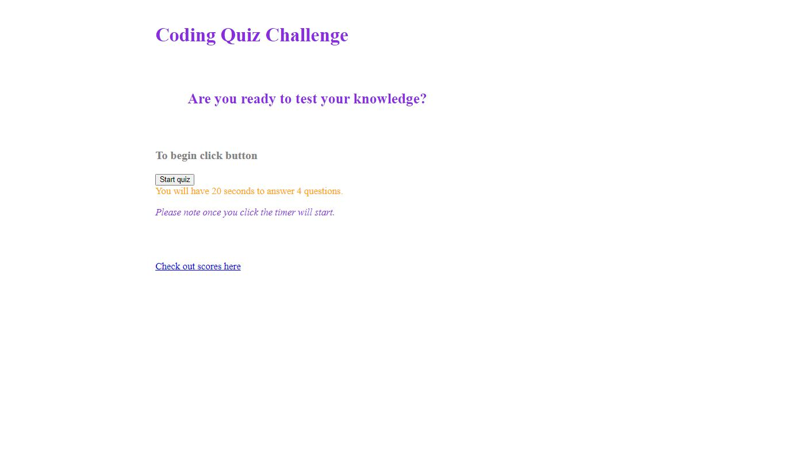

# UofA-Module4-APICodeQuiz-LSandura
Fourth Bootcamp Module 4 Challenge completed by Laura Sandura

Main Objective: 
    Build a time coding quiz assessment with multiple choice questions in preparation of becoming a full-stack web developer

Challenge: 
    App runs in browser with dynamic HTML and CSS powered by JavaScript written without beginner code. It looks polished and is interactive for the user.

Additional Expectations:
    Have a clickable start button with a timer that starts

    presented with a question, user is able to answer, then another questions appears to be answered

    If user answers question incorrectly the user loses time on the clock

    When all questions are answered and the timer runs out the game is over

    At the end of the game the user is able to save their initials and their score
    
Assignment Example Picture:
Website page 1

Website page 2

    
Repository link where finalzed project can be pulled:
    https://github.com/laurabora118/UofA-Module4-APICodeQuiz-LSandura

Git Repository Site that shows finalized projectresults:

    
References:
    1 - Assignment criteria received in UofA assignment 

